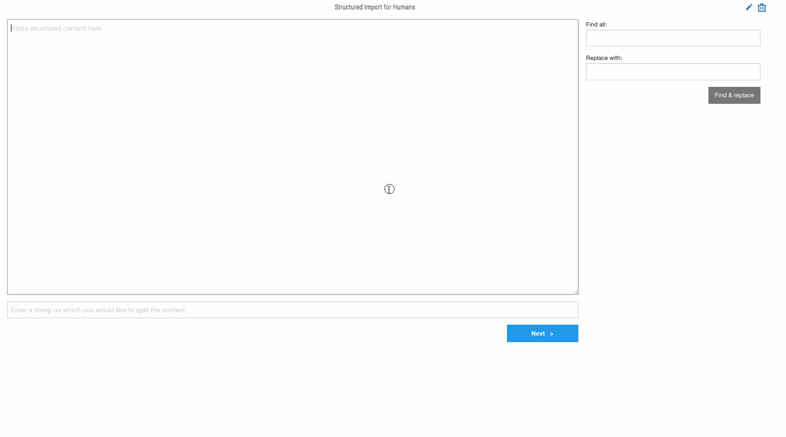

# Structured Import (JavaScript)

**NOTE:** A maintained version of this app is here: https://gitlab.com/fhightower/structured-import-app .

Structured import for humans (written in JavaScript).



**Please note:** this app will soon be replaced with an improved version written in angular. This newer app is available [here](https://github.com/fhightower-tc/structured-import-app).

## Build App For Release

```
make pack
```

This will package the app as `TCS_-_Structured_Import.zip`.

## Deploy

In the ThreatConnect UI install the App (the `.zip` file) created in the [Build App for Release](#build-app-for-release) section.

## Credits

This package was created with [Cookiecutter](https://github.com/audreyr/cookiecutter) and [Floyd Hightower's Spaces App Template](https://github.com/fhightower-templates/threatconnect-js-spaces-template).
